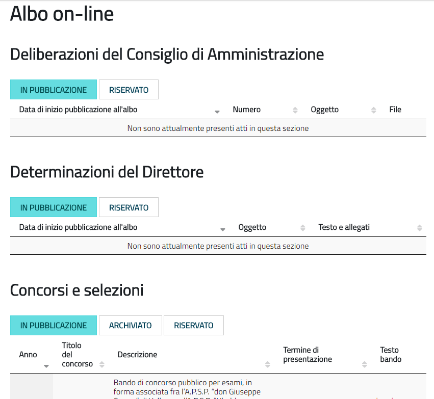
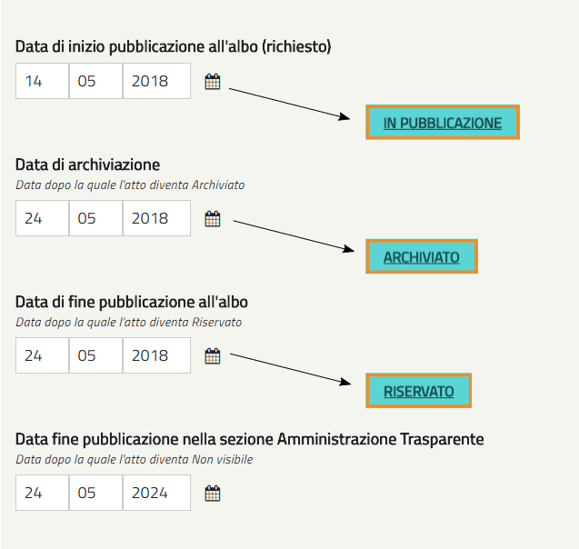
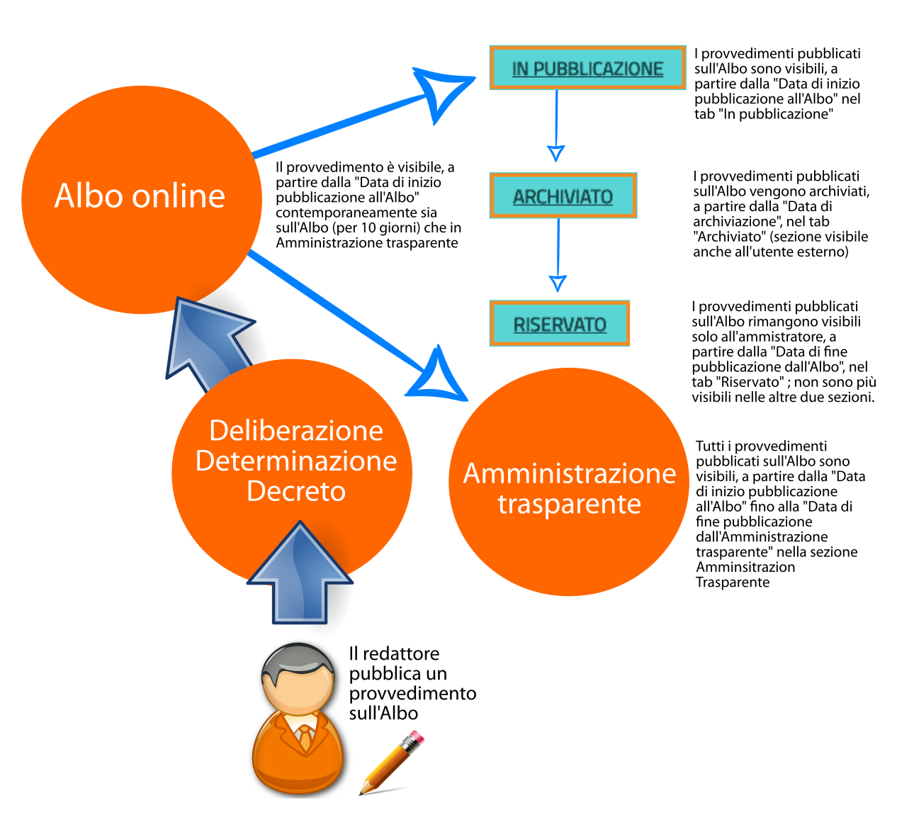

.. _h6ba4e4b5826663a6f382847212c695f:

Albo online
***********

\ |STYLE0|\  \ |LINK1|\ \ |STYLE1|\ 

Es.: \ |LINK2|\  

\ |IMG1|\ 

La sezione Albo online, di default, è suddivisa nelle seguenti sezioni: 

* Avvisi 

* \ |LINK3|\ 

* \ |LINK4|\ 

* Decreti

* \ |LINK5|\ 

* Bandi di gara

Tutte le sottosezioni della sezione Albo online devono essere di tipo “Frontpage” (\ |LINK6|\ ). La visualizzazione di tipo tabellare viene gestita attraverso un blocco (\ |LINK7|\ ) di tipo “Atti Albo online”, inserito all’interno del layout della Frontpage.

In questa sezione del sito vanno pubblicati tutti i contenuti appartenenti alle seguenti categorie: 

* Avviso

* \ |LINK8|\ 

* \ |LINK9|\ 

* Decreto

* \ |LINK10|\ 

* Bando di gara

Tutti gli oggetti delle suddette tipologie vanno pubblicati nell’Albo online e \ |STYLE2|\  in Amministrazione trasparente, specificando le seguenti informazioni, in base alle proprie esigenze:

* \ |STYLE3|\  a partire da questa data, l’atto è pubblicato in Albo on-line nel tab "In pubblicazione”

* \ |STYLE4|\  a raggiungimento di questa data, l’atto in Albo on-line è raggiungibile nel tab “Archiviato”. La sezione “Archiviato” può essere utilizzata per mettere a disposizione degli utenti esterni un archivio degli Atti pubblicati che non sono più “In pubblicazione”.

* \ |STYLE5|\ : a raggiungimento di questa data, l’atto in Albo on-line è raggiungibile solo nel tab "Riservato" che vedono solo gli amministratori del sito.

* \ |STYLE6|\ : a raggiungimento di questa data, l’atto diventerà Non visibile.

\ |IMG2|\ 

\ |IMG3|\ 

A partire dalla \ |STYLE7|\  tutti gli oggetti delle suddette categorie saranno parallelamente visibili, di default,  anche nella relativa sezione in Amministrazione trasparente fino alla \ |STYLE8|\ . 

\ |STYLE9|\ 

Tutti gli oggetti appartenenti alle suddette categorie hanno una numerazione progressiva flessibile (modificabile manualmente), che trovate alla voce "Numero progressivo di pubblicazione all'albo”.

Una volta inserito, per l’anno in corso, il primo "Numero progressivo di pubblicazione all'albo”, il sistema consiglierà, per ogni oggetto appartenente alle suddette categorie,  il numero successivo a quello dell'ultimo atto inserito (che siano Concorsi, Bandi di gara, Avvisi, Delibere, Determine o Decreti).

.. _h35277a162d6f4552f672e701c57633f:

Bandi di concorso
=================

I contenuti di tipo “\ |STYLE10|\ ” vanno inseriti direttamente e soltanto nella relativa sezione dell’Albo online; in questo modo, il sistema mostrerà una rappresentazione tabellare di questo tipo:

\ |LINK11|\  

All’interno dell’oggetto di tipo Bando di concorso possono essere inseriti direttamente come file allegati: la domanda di ammissione, Criteri di valutazione, Tracce delle prove scritte, Graduatoria finale di merito.

.. _h4c2e734922123173122a6a613354393c:

Determinazione 
===============

I contenuti di tipo “\ |STYLE11|\ ” vanno inseriti direttamente e soltanto nella relativa sezione dell’Albo online; in questo modo, il sistema mostrerà una rappresentazione tabellare di questo tipo:

\ |LINK12|\  

In particolare, ogni oggetto di tipo “Determinazione” pubblicato nella sezione Amministrazione trasparente dovrà contenere le seguenti informazioni:

* \ |STYLE12|\ : viene semplicemente mostrata ed utilizzata per dare il nome all'atto

* \ |STYLE13|\  

* \ |STYLE14|\ 

* \ |STYLE15|\ 

* \ |STYLE16|\  

In base a queste informazioni l’oggetto di tipo “Determinazione” viene automaticamente pubblicato anche nella sezione Amministrazione trasparente (vedi \ |LINK13|\ ).

Nella sezione Amministrazione trasparente, l’oggetto di tipo Determinazione sarà visibile e ricercabile a partire dalla Data di pubblicazione dell’oggetto di tipo “Determinazione” fino alla \ |STYLE17|\ : a raggiungimento di questa data, il provvedimento rimane visibile solo dagli amministratori del sito.

.. _h58111f3769395646065393c121d61c:

Deliberazione 
==============

In questa sezione, vanno inseriti direttamente contenuti di tipo “\ |STYLE18|\ ”; in questo modo, il sistema mostrerà una rappresentazione tabellare di questo tipo:

\ |LINK14|\ 

In particolare, ogni oggetto di tipo “Deliberazione” pubblicato nella sezione Amministrazione trasparente deve contenere le seguenti informazioni:

* \ |STYLE19|\ : viene semplicemente mostrata ed utilizzata per dare il nome all'atto

* \ |STYLE20|\  

* \ |STYLE21|\ 

* \ |STYLE22|\ 

* \ |STYLE23|\  

In base a queste informazioni l’oggetto di tipo “Deliberazione” viene automaticamente pubblicato anche nella sezione Albo online (vedi \ |LINK15|\ ).

Il provvedimento rimane visibile e ricercabile nella sezione Amministrazione trasparente a partire dalla Data di pubblicazione dell’oggetto di tipo “Deliberazione” fino alla \ |STYLE24|\ : a raggiungimento di questa data, il provvedimento rimane visibile solo dagli amministratori del sito.

.. _h2c1d74277104e41780968148427e:

.. _h2c1d74277104e41780968148427e:

.. _h6ba4e4b5826663a6f382847212c695f:

Albo online
***********

\ |STYLE25|\  \ |LINK16|\ \ |STYLE26|\ 

Es.: \ |LINK17|\  

\ |IMG4|\ 

La sezione Albo online, di default, è suddivisa nelle seguenti sezioni: 

* Avvisi 

* \ |LINK18|\ 

* \ |LINK19|\ 

* Decreti

* \ |LINK20|\ 

* Bandi di gara

Tutte le sottosezioni della sezione Albo online devono essere di tipo “Frontpage” (\ |LINK21|\ ). La visualizzazione di tipo tabellare viene gestita attraverso un blocco (\ |LINK22|\ ) di tipo “Atti Albo online”, inserito all’interno del layout della Frontpage.

In questa sezione del sito vanno pubblicati tutti i contenuti appartenenti alle seguenti categorie: 

* Avviso

* \ |LINK23|\ 

* \ |LINK24|\ 

* Decreto

* \ |LINK25|\ 

* Bando di gara

Tutti gli oggetti delle suddette tipologie vanno pubblicati nell’Albo online e \ |STYLE27|\  in Amministrazione trasparente, specificando le seguenti informazioni, in base alle proprie esigenze:

* \ |STYLE28|\  a partire da questa data, l’atto è pubblicato in Albo on-line nel tab "In pubblicazione”

* \ |STYLE29|\  a raggiungimento di questa data, l’atto in Albo on-line è raggiungibile nel tab “Archiviato”. La sezione “Archiviato” può essere utilizzata per mettere a disposizione degli utenti esterni un archivio degli Atti pubblicati che non sono più “In pubblicazione”.

* \ |STYLE30|\ : a raggiungimento di questa data, l’atto in Albo on-line è raggiungibile solo nel tab "Riservato" che vedono solo gli amministratori del sito.

* \ |STYLE31|\ : a raggiungimento di questa data, l’atto diventerà Non visibile.

\ |IMG5|\ 

\ |IMG6|\ 

A partire dalla \ |STYLE32|\  tutti gli oggetti delle suddette categorie saranno parallelamente visibili, di default,  anche nella relativa sezione in Amministrazione trasparente fino alla \ |STYLE33|\ . 

\ |STYLE34|\ 

Tutti gli oggetti appartenenti alle suddette categorie hanno una numerazione progressiva flessibile (modificabile manualmente), che trovate alla voce "Numero progressivo di pubblicazione all'albo”.

Una volta inserito, per l’anno in corso, il primo "Numero progressivo di pubblicazione all'albo”, il sistema consiglierà, per ogni oggetto appartenente alle suddette categorie,  il numero successivo a quello dell'ultimo atto inserito (che siano Concorsi, Bandi di gara, Avvisi, Delibere, Determine o Decreti).

.. _h35277a162d6f4552f672e701c57633f:

Bandi di concorso
=================

I contenuti di tipo “\ |STYLE35|\ ” vanno inseriti direttamente e soltanto nella relativa sezione dell’Albo online; in questo modo, il sistema mostrerà una rappresentazione tabellare di questo tipo:

\ |LINK26|\  

All’interno dell’oggetto di tipo Bando di concorso possono essere inseriti direttamente come file allegati: la domanda di ammissione, Criteri di valutazione, Tracce delle prove scritte, Graduatoria finale di merito.

.. _h4c2e734922123173122a6a613354393c:

Determinazione 
===============

I contenuti di tipo “\ |STYLE36|\ ” vanno inseriti direttamente e soltanto nella relativa sezione dell’Albo online; in questo modo, il sistema mostrerà una rappresentazione tabellare di questo tipo:

\ |LINK27|\  

In particolare, ogni oggetto di tipo “Determinazione” pubblicato nella sezione Amministrazione trasparente dovrà contenere le seguenti informazioni:

* \ |STYLE37|\ : viene semplicemente mostrata ed utilizzata per dare il nome all'atto

* \ |STYLE38|\  

* \ |STYLE39|\ 

* \ |STYLE40|\ 

* \ |STYLE41|\  

In base a queste informazioni l’oggetto di tipo “Determinazione” viene automaticamente pubblicato anche nella sezione Amministrazione trasparente (vedi \ |LINK28|\ ).

Nella sezione Amministrazione trasparente, l’oggetto di tipo Determinazione sarà visibile e ricercabile a partire dalla Data di pubblicazione dell’oggetto di tipo “Determinazione” fino alla \ |STYLE42|\ : a raggiungimento di questa data, il provvedimento rimane visibile solo dagli amministratori del sito.

.. _h58111f3769395646065393c121d61c:

Deliberazione 
==============

In questa sezione, vanno inseriti direttamente contenuti di tipo “\ |STYLE43|\ ”; in questo modo, il sistema mostrerà una rappresentazione tabellare di questo tipo:

\ |LINK29|\ 

In particolare, ogni oggetto di tipo “Deliberazione” pubblicato nella sezione Amministrazione trasparente deve contenere le seguenti informazioni:

* \ |STYLE44|\ : viene semplicemente mostrata ed utilizzata per dare il nome all'atto

* \ |STYLE45|\  

* \ |STYLE46|\ 

* \ |STYLE47|\ 

* \ |STYLE48|\  

In base a queste informazioni l’oggetto di tipo “Deliberazione” viene automaticamente pubblicato anche nella sezione Albo online (vedi \ |LINK30|\ ).

Il provvedimento rimane visibile e ricercabile nella sezione Amministrazione trasparente a partire dalla Data di pubblicazione dell’oggetto di tipo “Deliberazione” fino alla \ |STYLE49|\ : a raggiungimento di questa data, il provvedimento rimane visibile solo dagli amministratori del sito.

.. _h2c1d74277104e41780968148427e:

.. _h2c1d74277104e41780968148427e:

.. bottom of content

.. |STYLE0| replace:: *(con riferimento alla versione pubblicata sul sito pilota:*

.. |STYLE1| replace:: *)*

.. |STYLE2| replace:: **NON**

.. |STYLE3| replace:: **Data di inizio pubblicazione all'albo:**

.. |STYLE4| replace:: **Data di archiviazione:**

.. |STYLE5| replace:: **Data di fine pubblicazione all'albo**

.. |STYLE6| replace:: **Data di fine pubblicazione nella sezione Amministrazione trasparente**

.. |STYLE7| replace:: **Data di inizio pubblicazione all’Albo**

.. |STYLE8| replace:: **Data di fine pubblicazione nella sezione Amministrazione Trasparente**

.. |STYLE9| replace:: **Non vi è quindi alcuna necessità di pubblicare i contenuti appartenenti alle suddette categorie nella sezione Amministrazione trasparente.**

.. |STYLE10| replace:: **Bando di concorso**

.. |STYLE11| replace:: **Determinazione**

.. |STYLE12| replace:: **Data della determina**

.. |STYLE13| replace:: **Data di inizio pubblicazione all'albo**

.. |STYLE14| replace:: **Data di archiviazione**

.. |STYLE15| replace:: **Data di fine pubblicazione all'albo**

.. |STYLE16| replace:: **Data fine pubblicazione nella sezione Amministrazione Trasparente**

.. |STYLE17| replace:: **Data fine pubblicazione nella sezione Amministrazione Trasparente**

.. |STYLE18| replace:: **Deliberazione**

.. |STYLE19| replace:: **Data della delibera**

.. |STYLE20| replace:: **Data di inizio pubblicazione all'albo**

.. |STYLE21| replace:: **Data di archiviazione**

.. |STYLE22| replace:: **Data di fine pubblicazione all'albo**

.. |STYLE23| replace:: **Data fine pubblicazione nella sezione Amministrazione Trasparente**

.. |STYLE24| replace:: **Data fine pubblicazione nella sezione Amministrazione Trasparente**

.. |STYLE25| replace:: *(con riferimento alla versione pubblicata sul sito pilota:*

.. |STYLE26| replace:: *)*

.. |STYLE27| replace:: **NON**

.. |STYLE28| replace:: **Data di inizio pubblicazione all'albo:**

.. |STYLE29| replace:: **Data di archiviazione:**

.. |STYLE30| replace:: **Data di fine pubblicazione all'albo**

.. |STYLE31| replace:: **Data di fine pubblicazione nella sezione Amministrazione trasparente**

.. |STYLE32| replace:: **Data di inizio pubblicazione all’Albo**

.. |STYLE33| replace:: **Data di fine pubblicazione nella sezione Amministrazione Trasparente**

.. |STYLE34| replace:: **Non vi è quindi alcuna necessità di pubblicare i contenuti appartenenti alle suddette categorie nella sezione Amministrazione trasparente.**

.. |STYLE35| replace:: **Bando di concorso**

.. |STYLE36| replace:: **Determinazione**

.. |STYLE37| replace:: **Data della determina**

.. |STYLE38| replace:: **Data di inizio pubblicazione all'albo**

.. |STYLE39| replace:: **Data di archiviazione**

.. |STYLE40| replace:: **Data di fine pubblicazione all'albo**

.. |STYLE41| replace:: **Data fine pubblicazione nella sezione Amministrazione Trasparente**

.. |STYLE42| replace:: **Data fine pubblicazione nella sezione Amministrazione Trasparente**

.. |STYLE43| replace:: **Deliberazione**

.. |STYLE44| replace:: **Data della delibera**

.. |STYLE45| replace:: **Data di inizio pubblicazione all'albo**

.. |STYLE46| replace:: **Data di archiviazione**

.. |STYLE47| replace:: **Data di fine pubblicazione all'albo**

.. |STYLE48| replace:: **Data fine pubblicazione nella sezione Amministrazione Trasparente**

.. |STYLE49| replace:: **Data fine pubblicazione nella sezione Amministrazione Trasparente**

.. |LINK1| raw:: html

    <a href="http://www.vallarsa.upipa.opencontent.it/Albo-on-line" target="_blank">www.vallarsa.upipa.opencontent.it/Albo-on-line</a>

.. |LINK2| raw:: html

    <a href="https://vallarsa.upipa.opencontent.it/Albo-on-line" target="_blank">https://vallarsa.upipa.opencontent.it/Albo-on-line</a>

.. |LINK3| raw:: html

    <a href="https://docs.google.com/document/d/1QMqG3bTPhLmwiSuzzakZZrWCzjS2nHBcc1yfBXVesZQ/edit#heading=h.fl5vina16s18" target="_blank">Delibere del Consiglio di amministrazione</a>

.. |LINK4| raw:: html

    <a href="https://docs.google.com/document/d/1QMqG3bTPhLmwiSuzzakZZrWCzjS2nHBcc1yfBXVesZQ/edit#heading=h.f4v4212vf966" target="_blank">Determinazioni del direttore</a>

.. |LINK5| raw:: html

    <a href="https://docs.google.com/document/d/1QMqG3bTPhLmwiSuzzakZZrWCzjS2nHBcc1yfBXVesZQ/edit#heading=h.19ju15id9o28" target="_blank">Concorsi e selezioni</a>

.. |LINK6| raw:: html

    <a href="https://docs.google.com/document/d/1QMqG3bTPhLmwiSuzzakZZrWCzjS2nHBcc1yfBXVesZQ/edit#heading=h.ynirymlh8c2j" target="_blank">Come analizzare la tipologia di contenuto pubblicato</a>

.. |LINK7| raw:: html

    <a href="https://docs.google.com/document/d/1QMqG3bTPhLmwiSuzzakZZrWCzjS2nHBcc1yfBXVesZQ/edit#heading=h.x82rs7i5hv3h" target="_blank">Come gestire i blocchi</a>

.. |LINK8| raw:: html

    <a href="#heading=h.ub21usqygjy">Deliberazione</a>

.. |LINK9| raw:: html

    <a href="#heading=h.la3pocndzk7r">Determinazione</a>

.. |LINK10| raw:: html

    <a href="#heading=h.ytqp9wjc6j3f">Bando di concorso</a>

.. |LINK11| raw:: html

    <a href="https://vallarsa.upipa.opencontent.it/Albo-on-line/Concorsi-e-Selezioni" target="_blank">https://vallarsa.upipa.opencontent.it/Albo-on-line/Concorsi-e-Selezioni</a>

.. |LINK12| raw:: html

    <a href="https://vallarsa.upipa.opencontent.it/Albo-on-line/Determinazioni-del-Direttore" target="_blank">https://vallarsa.upipa.opencontent.it/Albo-on-line/Determinazioni-del-Direttore</a>

.. |LINK13| raw:: html

    <a href="https://docs.google.com/document/d/1QMqG3bTPhLmwiSuzzakZZrWCzjS2nHBcc1yfBXVesZQ/edit#heading=h.8sqa95gyf8q3" target="_blank">Albo online</a>

.. |LINK14| raw:: html

    <a href="https://vallarsa.upipa.opencontent.it/Amministrazione-Trasparente/Provvedimenti/Provvedimenti-degli-organi-di-indirizzo-politico" target="_blank">https://vallarsa.upipa.opencontent.it/Amministrazione-Trasparente/Provvedimenti/Provvedimenti-degli-organi-di-indirizzo-politico</a>

.. |LINK15| raw:: html

    <a href="https://docs.google.com/document/d/1QMqG3bTPhLmwiSuzzakZZrWCzjS2nHBcc1yfBXVesZQ/edit#heading=h.8sqa95gyf8q3" target="_blank">Albo online</a>

.. |LINK16| raw:: html

    <a href="http://www.vallarsa.upipa.opencontent.it/Albo-on-line" target="_blank">www.vallarsa.upipa.opencontent.it/Albo-on-line</a>

.. |LINK17| raw:: html

    <a href="https://vallarsa.upipa.opencontent.it/Albo-on-line" target="_blank">https://vallarsa.upipa.opencontent.it/Albo-on-line</a>

.. |LINK18| raw:: html

    <a href="https://docs.google.com/document/d/1QMqG3bTPhLmwiSuzzakZZrWCzjS2nHBcc1yfBXVesZQ/edit#heading=h.fl5vina16s18" target="_blank">Delibere del Consiglio di amministrazione</a>

.. |LINK19| raw:: html

    <a href="https://docs.google.com/document/d/1QMqG3bTPhLmwiSuzzakZZrWCzjS2nHBcc1yfBXVesZQ/edit#heading=h.f4v4212vf966" target="_blank">Determinazioni del direttore</a>

.. |LINK20| raw:: html

    <a href="https://docs.google.com/document/d/1QMqG3bTPhLmwiSuzzakZZrWCzjS2nHBcc1yfBXVesZQ/edit#heading=h.19ju15id9o28" target="_blank">Concorsi e selezioni</a>

.. |LINK21| raw:: html

    <a href="https://docs.google.com/document/d/1QMqG3bTPhLmwiSuzzakZZrWCzjS2nHBcc1yfBXVesZQ/edit#heading=h.ynirymlh8c2j" target="_blank">Come analizzare la tipologia di contenuto pubblicato</a>

.. |LINK22| raw:: html

    <a href="https://docs.google.com/document/d/1QMqG3bTPhLmwiSuzzakZZrWCzjS2nHBcc1yfBXVesZQ/edit#heading=h.x82rs7i5hv3h" target="_blank">Come gestire i blocchi</a>

.. |LINK23| raw:: html

    <a href="#heading=h.ub21usqygjy">Deliberazione</a>

.. |LINK24| raw:: html

    <a href="#heading=h.la3pocndzk7r">Determinazione</a>

.. |LINK25| raw:: html

    <a href="#heading=h.ytqp9wjc6j3f">Bando di concorso</a>

.. |LINK26| raw:: html

    <a href="https://vallarsa.upipa.opencontent.it/Albo-on-line/Concorsi-e-Selezioni" target="_blank">https://vallarsa.upipa.opencontent.it/Albo-on-line/Concorsi-e-Selezioni</a>

.. |LINK27| raw:: html

    <a href="https://vallarsa.upipa.opencontent.it/Albo-on-line/Determinazioni-del-Direttore" target="_blank">https://vallarsa.upipa.opencontent.it/Albo-on-line/Determinazioni-del-Direttore</a>

.. |LINK28| raw:: html

    <a href="https://docs.google.com/document/d/1QMqG3bTPhLmwiSuzzakZZrWCzjS2nHBcc1yfBXVesZQ/edit#heading=h.8sqa95gyf8q3" target="_blank">Albo online</a>

.. |LINK29| raw:: html

    <a href="https://vallarsa.upipa.opencontent.it/Amministrazione-Trasparente/Provvedimenti/Provvedimenti-degli-organi-di-indirizzo-politico" target="_blank">https://vallarsa.upipa.opencontent.it/Amministrazione-Trasparente/Provvedimenti/Provvedimenti-degli-organi-di-indirizzo-politico</a>

.. |LINK30| raw:: html

    <a href="https://docs.google.com/document/d/1QMqG3bTPhLmwiSuzzakZZrWCzjS2nHBcc1yfBXVesZQ/edit#heading=h.8sqa95gyf8q3" target="_blank">Albo online</a>

