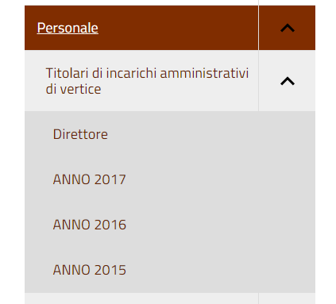

.. _h6c66692c2a6262374a25355850204a69:

Amministrazione Trasparente
***************************

La sezione “Amministrazione Trasparente” deve essere alimentata usando esclusivamente i formati raccomandati dalla piattaforma. In questo modo, si otterranno numerosi vantaggi, in particolare:

*  Allineamento automatico al modello centrale, validato dai consulenti UPIPA

* Consulenza e monitoraggio sistematico da parte di UPIPA sull’utilizzo del sistema da parte dei soci

* Supporto in presenza o da remoto nella risoluzione dei problemi

.. _h2c1d74277104e41780968148427e:

.. _h7fa245d1f4f3a2f1b473a669793f6c:

Raccomandazioni generali
========================

* Non creare oggetti di tipo “Pagina del sito” o “Pagina trasparenza”, quando non strettamente indispensabile; in ogni caso, si raccomanda di chiedere consiglio allo sportello di supporto prima di intervenire

* I dati in formato tabellare non devono essere caricati massivamente come file (es, pdf), ma vanno gestiti utilizzando le tipologie di oggetti specifici previsti nelle varie sezioni del sito in modo tale che sia il sistema a generare automaticamente delle tabelle

.. _h2c1d74277104e41780968148427e:

.. _h2c1d74277104e41780968148427e:

.. _h2c1d74277104e41780968148427e:

.. _h2c1d74277104e41780968148427e:

.. _h2c1d74277104e41780968148427e:

.. _h2c1d74277104e41780968148427e:

.. _h2c1d74277104e41780968148427e:

.. _h2c1d74277104e41780968148427e:

.. _h466166c48694f75472d553f6c25f51:

Piano Triennale per la Prevenzione della Corruzione e della Trasparenza (PTPCT)
===============================================================================

In questa sezione si consiglia di utilizzare l’oggetto di tipo “\ |STYLE0|\ ”, che consente di gestire ordinatamente il Piano Triennale di Prevenzione della Corruzione e della Trasparenza, raccogliendo le informazioni e gli allegati da esso richiesti e controllandone automaticamente la rappresentazione:

* Titolo (predefinito)

* Periodo di validità: dall’anno... All’anno…

* Descrizione

* Testo del piano (documento da caricare)

* Estremi dell'atto di approvazione del piano (richiesto)

* Mappa dei rischi con le azioni preventive e correttive, tempi e responsabilità

* Codice di comportamento aziendale

* Albero della trasparenza

Un esempio:

\ |LINK1|\  

Nota bene:

Per quanto riguarda la mappa dei rischi, si consiglia di utilizzare informazioni strutturate partendo da fogli di calcolo da importare via CSV (vedi \ |LINK2|\ ), evitando il caricamento di file pdf. 

Qualora fosse disponibile solo il file pdf, si può risalire al formato elettronico tabellare con strumenti come questo: \ |LINK3|\ 

.. _h417154247832772b6b70292364551ec:

Consulenti e collaboratori
==========================

In questa sezione va pubblicato l'elenco degli incarichi di collaborazione o di consulenza a soggetti esterni a qualsiasi titolo (compresi quelli affidati con contratto di collaborazione coordinata e continuativa) con indicazione della ragione e della durata dell'incarico, del soggetto incaricato ed del suo curriculum vitae dell'ammontare previsto ed erogato.

In questa sezione, vanno inseriti direttamente contenuti di tipo “\ |STYLE1|\ ”; in questo modo, il sistema mostrerà una rappresentazione tabellare di questo tipo:

\ |LINK4|\  

Esempio: group_by:anno|consulenza_collaborazione|soggetto_percettore,ragione_incarico,dal,al,ammontare,erogato|1

.. _h673991065182170554949531b9567b:

Personale
=========

.. _h7b637b41511487e565d522c2e32455e:

Titolari di incarichi amministrativi di vertice
-----------------------------------------------

In questa sezione, vanno inseriti direttamente contenuti di tipo “\ |STYLE2|\ ”; in questo modo, il sistema mostrerà una rappresentazione tabellare di questo tipo:

\ |LINK5|\  

Per cui si consiglia di non suddividere i contenuti per anno: \ |IMG1|\ 

bensì di creare un oggetto di tipo \ |STYLE3|\  che raccolga da solo le diverse informazioni (per esempio relative alla retribuzione annuale)

.. _h2c1d74277104e41780968148427e:

.. _h2c1d74277104e41780968148427e:

.. _h2d78b282527aa41f7e2a25b401:

Bilancio consuntivo e previsionale
==================================

La sezione si divide in Bilancio consuntivo e Bilancio preventivo:

Per la prima sezione si raccomanda di utilizzare la classe: "\ |STYLE4|\ ";

Esempio: https://vallarsa.upipa.opencontent.it/Amministrazione-Trasparente/Bilanci/Bilancio-preventivo-e-consuntivo/Bilancio-consuntivo

Per la seconda sezione si raccomanda di utilizzare la classe: "\ |STYLE5|\ "

Esempio: https://vallarsa.upipa.opencontent.it/Amministrazione-Trasparente/Bilanci/Bilancio-preventivo-e-consuntivo/Bilancio-preventivo

.. bottom of content

.. |STYLE0| replace:: **Piano Triennale PCT**

.. |STYLE1| replace:: **Consulenza o Collaborazione**

.. |STYLE2| replace:: **Dipendente**

.. |STYLE3| replace:: **Dipendente**

.. |STYLE4| replace:: **Bilancio consuntivo**

.. |STYLE5| replace:: **Bilancio preventivo**

.. |LINK1| raw:: html

    <a href="https://vallarsa.upipa.opencontent.it/Amministrazione-Trasparente/Disposizioni-generali/Piano-Triennale-per-la-Prevenzione-della-Corruzione-e-della-Trasparenza-PTPCT" target="_blank">https://vallarsa.upipa.opencontent.it/Amministrazione-Trasparente/Disposizioni-generali/Piano-Triennale-per-la-Prevenzione-della-Corruzione-e-della-Trasparenza-PTPCT</a>

.. |LINK2| raw:: html

    <a href="https://docs.google.com/document/d/1QMqG3bTPhLmwiSuzzakZZrWCzjS2nHBcc1yfBXVesZQ/edit#heading=h.wix8zc3h85jc" target="_blank">Caricamento di dati strutturati via CSV</a>

.. |LINK3| raw:: html

    <a href="https://smallpdf.com/it/pdf-in-excel" target="_blank">https://smallpdf.com/it/pdf-in-excel</a>

.. |LINK4| raw:: html

    <a href="https://vallarsa.upipa.opencontent.it/Amministrazione-Trasparente/Consulenti-e-collaboratori/" target="_blank">https://vallarsa.upipa.opencontent.it/Amministrazione-Trasparente/Consulenti-e-collaboratori/</a>

.. |LINK5| raw:: html

    <a href="https://vallarsa.upipa.opencontent.it/Amministrazione-Trasparente/Personale/Titolari-di-incarichi-amministrativi-di-vertice" target="_blank">https://vallarsa.upipa.opencontent.it/Amministrazione-Trasparente/Personale/Titolari-di-incarichi-amministrativi-di-vertice</a>

