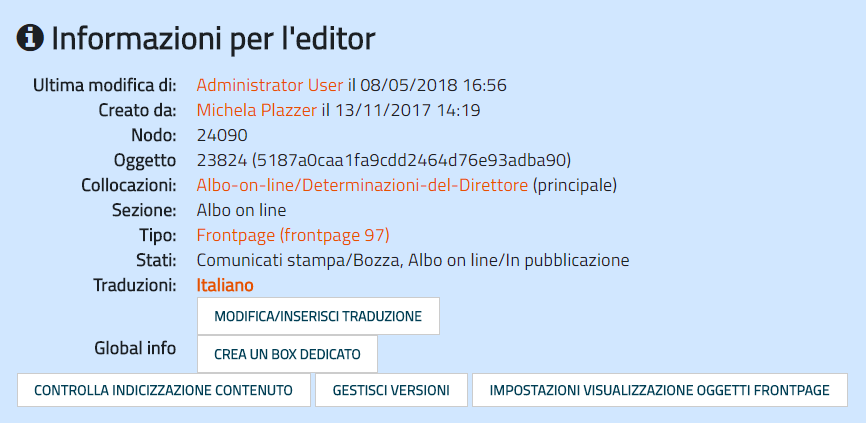
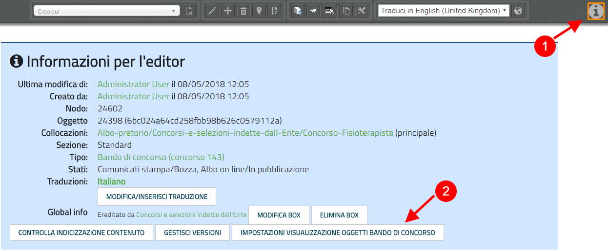
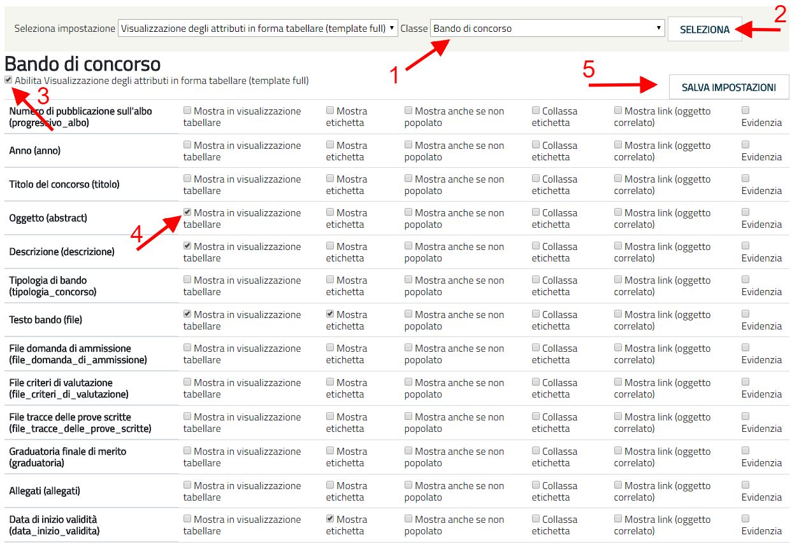

.. _h42492050f7b71b11565635022643f:

Funzionalità da conoscere
*************************

.. _h2372393a171c4876da3830657d173:

Caricamento di dati strutturati via CSV
=======================================

C’è la possibilità di caricare i dati pregressi strutturati in fogli di calcolo attraverso un importazione massiva dei contenuti, in modo da risparmiare il tempo del caricamento manuale. 

Sarà possibile approfondire questo argomento in sede di formazione.

.. _h6c44451e1e364236ee2244502c4f57:

Come analizzare la tipologia di contenuto pubblicato
====================================================

Eseguendo l’accesso (login) al sito con le proprie credenziali, è possibile analizzare la tipologia di contenuto pubblicato, cliccando sulla “i” alla destra della website toolbar.

Si aprirà una finestra in cui potete trovare alcune preziose “Informazioni per l’editor”.

\ |IMG1|\ 

.. _h66bd222716207a117f16b3225770:

Impostazioni visualizzazione oggetti
====================================

Eseguendo l’accesso (login) al sito con le proprie credenziali, cliccare sulla “i” alla destra della website toolbar (1).

All’interno del box “Informazioni per l’editor”, cliccare su “Impostazioni visualizzazione oggetti ‘nome_classe_da_modificare’” (2).

.. _h791137197930656d4a307c1b41594e2e:

\ |IMG2|\ ==========

Controllare che la classe selezionata sia effettivamente quella che di cui si vuole modificare la visualizzazione.

Per esempio, se si vuole modificare la visualizzazione della classe “Bando di concorso”, controllare che la classe selezionato nel riquadro a destra in alto sia quella corretta (1). 

Se non è corretta, cercare la classe che si vuole modificare all’interno del menù a tendina e cliccare su “Seleziona” (2).

Controllare che sia abilitata la “Visualizzazione degli attributi in forma tabellare (template full)”. Se non è abilitata, cliccare sul checkbox (3).

Successivamente, si può procedere alla selezione dei checkbox relativi agli attributi che si vogliono visualizzare.

\ |STYLE0|\ : mostra il contenuto inserito dall’editor. Per esempio, dell’attributo “Anno”, mostrerà il contenuto (es.: “2018”).

\ |STYLE1|\ : mostra l’etichetta dell’attributo. Per esempio, dell’attributo “Anno”, mostrerà l’etichetta “Anno”.

\ |STYLE2|\  mostra l’etichetta di un attributo anche se non popolato. Per esempio dell’attributo “Anno”, che non contiene alcun contenuto, verrà mostrata comunque l’etichetta “Anno”.

\ |STYLE3|\ 

\ |STYLE4|\  mostra il link e rende cliccabile l’oggetto correlato (es.: File da scaricare, Riferimento ad un altro oggetto presente nel sito).

\ |STYLE5|\ 

Infine, cliccare sul pulsante “Salva impostazioni” (5), per salvare le scelte effettuate.

Le impostazioni selezionate valgono per tutti gli oggetti appartenenti a quella categoria (per esempio per tutti gli oggetti di tipo “Bando di concorso”).

\ |IMG3|\ 

.. _h2c1d74277104e41780968148427e:

.. _h134c252677a7254751661226b3d38a:

Struttura del sito
******************

.. _h7d7047805a12f41454034755c375870:

Organizzazione
==============

In questa sezione si consiglia di pubblicare la struttura della propria organizzazione, utilizzando come guida il proprio organigramma.

In base alle Aree, Servizi e Uffici presenti nell’organigramma, si consiglia di creare, in ordine, le differenti pagine contenitore (utilizzando in questo caso, come pagina contenitore, la classe “Pagina del sito”).

.. _h5a635d3d2b1673791192a4f6d6039:

Aree
----

All’interno di questa Pagina del sito si raccomanda di creare oggetti di tipo “\ |STYLE6|\ ” per ogni area presente nell’organigramma. 

Es.: \ |LINK1|\ 

\ |STYLE7|\  

.. _h4206f375449d2593c122327335225:

Servizi
-------

All’interno di questa pagina si raccomanda di creare oggetti di tipo “\ |STYLE8|\ ” per ogni servizio presente nell’organigramma. L’oggetto Servizio va correlato con un oggetto di tipo Area, se presente.

    Es.: \ |LINK2|\    

.. _h3016382377345a17445517131e5e4515:

Uffici
------

All’interno di questa pagina si raccomanda di creare oggetti di tipo “\ |STYLE9|\ ” per ogni ufficio presente nell’organigramma. L’oggetto Ufficio va correlato con un oggetto di tipo Servizio.

    Es.: \ |LINK3|\  

.. _h112e363548804723d644a25d2e5020:

Organigramma
------------

Una volta creati tutte le Aree, tutti i Servizi e i relativi Uffici avendo cura di specificare le relazioni tra uffici e servizi e tra servizi e aree, si consiglia di creare, proprio all’interno della pagina “Organizzazione”, allo stesso livello quindi delle pagine Aree, Servizi, Uffici, un oggetto di tipo “\ |STYLE10|\ ”.

L’oggetto “Organigramma” pescherà automaticamente da tutte le aree, i servizi e gli uffici per creare una rappresentazione grafica di questo tipo:

\ |LINK4|\  

.. _h2c1d74277104e41780968148427e:

.. bottom of content

.. |STYLE0| replace:: **Mostra in visualizzazione tabellare**

.. |STYLE1| replace:: **Mostra etichetta**

.. |STYLE2| replace:: **Mostra anche se non popolato:**

.. |STYLE3| replace:: **Collassa etichetta:**

.. |STYLE4| replace:: **Mostra link (oggetto correlato):**

.. |STYLE5| replace:: **Evidenzia:**

.. |STYLE6| replace:: **Area**

.. |STYLE7| replace:: *Nel caso in cui nel vostro organigramma NON siano presenti Aree, si prega di saltare questo passaggio.*

.. |STYLE8| replace:: **Servizio**

.. |STYLE9| replace:: **Ufficio**

.. |STYLE10| replace:: **Organigramma**

.. |LINK1| raw:: html

    <a href="https://vallarsa.upipa.opencontent.it/Azienda/Organizzazione/Aree/Area-Area-socio-sanitaria-e-assistenziale" target="_blank">https://vallarsa.upipa.opencontent.it/Azienda/Organizzazione/Aree/Area-Area-socio-sanitaria-e-assistenziale</a>

.. |LINK2| raw:: html

    <a href="https://vallarsa.upipa.opencontent.it/Azienda/Organizzazione/Servizi/Servizio-medico" target="_blank">https://vallarsa.upipa.opencontent.it/Azienda/Organizzazione/Servizi/Servizio-medico</a>

.. |LINK3| raw:: html

    <a href="https://vallarsa.upipa.opencontent.it/Azienda/Organizzazione/Uffici/Contabilita-e-bilancio" target="_blank">https://vallarsa.upipa.opencontent.it/Azienda/Organizzazione/Uffici/Contabilita-e-bilancio</a>

.. |LINK4| raw:: html

    <a href="https://vallarsa.upipa.opencontent.it/Azienda/Organizzazione/Organigramma" target="_blank">https://vallarsa.upipa.opencontent.it/Azienda/Organizzazione/Organigramma</a>

