Il sistema UpipaWeb viene offerto a tutti gli enti soci come piattaforma SaaS (software as a service). Si tratta di una piattaforma omogenea, che supporta gli enti nella strutturazione dei dati e nella pubblicazione.

.. _h2f21465d513b71a6a45616a2034a53:

Strumenti di supporto
*********************

I soci Upipa che aderiscono al progetto hanno accesso a:

* Forum con le FAQ 

* Sistema di supporto

* Presente documentazione

.. _h2c1d74277104e41780968148427e:

.. _h2c1d74277104e41780968148427e:

.. _h2c1d74277104e41780968148427e:

.. _h2c1d74277104e41780968148427e:

.. _h2c1d74277104e41780968148427e:

.. _h2c1d74277104e41780968148427e:

.. _h2c1d74277104e41780968148427e:

.. _h2c1d74277104e41780968148427e:

.. _h2c1d74277104e41780968148427e:

.. _h2c1d74277104e41780968148427e:

.. _h2c1d74277104e41780968148427e:

.. _h42492050f7b71b11565635022643f:

Funzionalità da conoscere
*************************

.. _h2372393a171c4876da3830657d173:

Caricamento di dati strutturati via CSV
=======================================

C’è la possibilità di caricare i dati pregressi strutturati in fogli di calcolo attraverso un importazione massiva dei contenuti, in modo da risparmiare il tempo del caricamento manuale. 

Per il caricamento è necessario compilare i file messi a disposizione da UPIPA (contattare eventualmente \ |LINK1|\ ), o accessibili a questo \ |LINK2|\  (solo come utenti registrati) seguendo le indicazioni e inviarli poi sempre a \ |LINK3|\  per l’importazione massiva.

Qualora aveste i contenuti disponibili solo in file pdf, si può risalire al formato elettronico tabellare con strumenti come questo: \ |LINK4|\ 

.. _h6c44451e1e364236ee2244502c4f57:

Come analizzare la tipologia di contenuto pubblicato
====================================================

Eseguendo l’accesso (login) al sito con le proprie credenziali, è possibile analizzare la tipologia di contenuto pubblicato, cliccando sulla “i” alla destra della website toolbar.

Si aprirà una finestra in cui potete trovare alcune preziose “Informazioni per l’editor”.

\ |IMG1|\ 

.. _h2c1d74277104e41780968148427e:

.. _h66bd222716207a117f16b3225770:

Impostazioni visualizzazione oggetti
====================================

\ |IMG2|\ 

#. Eseguendo l’accesso (login) al sito con le proprie credenziali, cliccare sulla “i” alla destra della website toolbar (1).

#. All'interno del box “Informazioni per l’editor”, cliccare su “Impostazioni visualizzazione oggetti ‘nome_classe_da_modificare’” (2).

\ |IMG3|\ 

#. Controllare che la classe selezionata sia effettivamente quella che di cui si vuole modificare la visualizzazione.

    Per esempio, se si vuole modificare la visualizzazione della classe “Bando di concorso”, controllare che la classe selezionato nel riquadro a destra in alto sia quella corretta (1). 

    Se non è corretta, cercare la classe che si vuole modificare all'interno del menù a tendina e cliccare su “Seleziona” (2).

#. Controllare che sia abilitata la “Visualizzazione degli attributi in forma tabellare (template full)”. Se non è abilitata, cliccare sul checkbox (3).

#. Successivamente, si può procedere alla selezione dei checkbox relativi agli attributi che si vogliono visualizzare (4).

----------------------------------------------------------------------------------------------------------------------------------------------

\ |STYLE0|\ 

* \ |STYLE1|\ 

    Mostra il contenuto inserito dall’editor. Per esempio, dell’attributo “Anno”, mostrerà il contenuto (es.: “2018”).

\ |IMG4|\ 

\ |IMG5|\ 

* \ |STYLE2|\ 

    Mostra l’etichetta dell’attributo. Per esempio, dell’attributo “Anno”, mostrerà l’etichetta “Anno”. 

\ |IMG6|\ 

    Il checkbox "Mostra etichetta" ha effetto nel caso in cui anche il checkbox "Mostra in visualizzazione tabellare" sia stato selezionato.

\ |IMG7|\ 

* \ |STYLE3|\ 

    Mostra l’etichetta di un attributo anche se non popolato. Per esempio dell’attributo “Data di archiviazione”, che non contiene alcun contenuto o informazione, verrà mostrata comunque l’etichetta “Data di archiviazione”.

\ |IMG8|\ 

    Il checkbox "Mostra anche se non popolato" ha effetto nel caso in cui anche i checkbox "Mostra in visualizzazione tabellare" e "Mostra etichetta" siano stati selezionati.

\ |IMG9|\ 

* \ |STYLE4|\ 

    Mostra il contenuto dell'attributo a capo riga. Per esempio per l'attributo “Anno", mostrerà l'etichetta "Anno" e il contenuto "2018" su due righe differenti.

\ |IMG10|\ 

    Il checkbox "Collassa etichetta" ha effetto nel caso in cui anche i checkbox "Mostra in visualizzazione tabellare" e "Mostra etichetta" siano stati selezionati.

\ |IMG11|\ 

* \ |STYLE5|\ 

    Mostra il link e rende cliccabile l’oggetto correlato (es.: Riferimento ad un altro oggetto presente nel sito).

    Prima:

\ |IMG12|\ 

    Dopo:

\ |IMG13|\ 

\ |IMG14|\ 

    Il checkbox "Mostra link (oggetto correlato)" ha effetto nel caso in cui anche i checkbox "Mostra in visualizzazione tabellare" e "Mostra etichetta" siano stati selezionati.

* Evidenzia

    Questa funzione non è disponibile.

--------------------------------------------------------------------------------------------------------------------------------------------------

#. Infine, cliccare sul pulsante “Salva impostazioni” (5), per salvare le scelte effettuate.

    Le impostazioni selezionate valgono per tutti gli oggetti appartenenti a quella categoria (per esempio per tutti gli oggetti di tipo “Bando di concorso”).

.. _h134c252677a7254751661226b3d38a:

Struttura del sito
******************

.. _h7d7047805a12f41454034755c375870:

Organizzazione
==============

In questa sezione si consiglia di pubblicare la struttura della propria organizzazione, utilizzando come guida il proprio organigramma.

In base alle Aree, Servizi e Uffici presenti nell’organigramma, si consiglia di creare, in ordine, le differenti pagine contenitore (utilizzando in questo caso, come pagina contenitore, la classe “Pagina del sito”).

.. _h5a635d3d2b1673791192a4f6d6039:

Aree
----

All’interno di questa Pagina del sito si raccomanda di creare oggetti di tipo “\ |STYLE6|\ ” per ogni area presente nell’organigramma. 

Es.: \ |LINK5|\ 

\ |STYLE7|\  

.. _h4206f375449d2593c122327335225:

Servizi
-------

All’interno di questa pagina si raccomanda di creare oggetti di tipo “\ |STYLE8|\ ” per ogni servizio presente nell’organigramma. L’oggetto Servizio va correlato con un oggetto di tipo Area, se presente.

    Es.: \ |LINK6|\    

.. _h3016382377345a17445517131e5e4515:

Uffici
------

All’interno di questa pagina si raccomanda di creare oggetti di tipo “\ |STYLE9|\ ” per ogni ufficio presente nell’organigramma. L’oggetto Ufficio va correlato con un oggetto di tipo Servizio.

    Es.: \ |LINK7|\  

.. _h112e363548804723d644a25d2e5020:

Organigramma
------------

Una volta creati tutte le Aree, tutti i Servizi e i relativi Uffici avendo cura di specificare le relazioni tra uffici e servizi e tra servizi e aree, si consiglia di creare, proprio all’interno della pagina “Organizzazione”, allo stesso livello quindi delle pagine Aree, Servizi, Uffici, un oggetto di tipo “\ |STYLE10|\ ”.

L’oggetto “Organigramma” pescherà automaticamente da tutte le aree, i servizi e gli uffici per creare una rappresentazione grafica di questo tipo:

\ |LINK8|\  

.. _h2c1d74277104e41780968148427e:

.. _h2c1d74277104e41780968148427e:

.. _h2c1d74277104e41780968148427e:

.. _h7e26c3f61617b115167e7874425e61:

Notizie
=======

In questa sezione si consiglia di utilizzare oggetti di tipo \ |STYLE11|\ .

Per gli oggetti di tipo Comunicato:

* la data di fine validità sposta l'oggetto in stato "archiviato" (ancora visibile all'utente esterno ma non in homepage)

* la data di fine pubblicazione sposta l'oggetto in "Oggetti scaduti", non più visibili all'utente esterno.

.. _h713c725f4c6660302ab426b397374:

Servizi erogati
===============

Per tutti i servizi \ |STYLE12|\  dalla APSP (es: servizio di ristorazione, servizi di manutenzione, servizio di pulizia) si consiglia di utilizzare la classe \ |STYLE13|\ .

.. _h2c1d74277104e41780968148427e:

.. _h2c1d74277104e41780968148427e:

.. _h2c1d74277104e41780968148427e:

.. _h2c1d74277104e41780968148427e:

.. _h2c1d74277104e41780968148427e:

.. _h2c1d74277104e41780968148427e:

.. _h2c1d74277104e41780968148427e:

.. _h2c1d74277104e41780968148427e:

.. _h2c1d74277104e41780968148427e:

.. _h6ba4e4b5826663a6f382847212c695f:

Albo online
***********

\ |STYLE14|\  \ |LINK9|\ \ |STYLE15|\ 

Es.: \ |LINK10|\  

\ |IMG15|\ 

La sezione Albo online, di default, è suddivisa nelle seguenti sezioni: 

* Avvisi 

* \ |LINK11|\ 

* \ |LINK12|\ 

* Decreti

* \ |LINK13|\ 

* Bandi di gara

Tutte le sottosezioni della sezione Albo online devono essere di tipo “\ |STYLE16|\ ” (\ |LINK14|\ ). La visualizzazione di tipo tabellare viene gestita attraverso un blocco (\ |LINK15|\ ) di tipo “Atti Albo online”, inserito all’interno del layout della Frontpage.

In questa sezione del sito vanno pubblicati tutti i contenuti appartenenti alle seguenti categorie: 

* Avviso

* \ |LINK16|\ 

* \ |LINK17|\ 

* Decreto

* \ |LINK18|\ 

* Bando di gara

Tutti gli oggetti delle suddette tipologie vanno pubblicati nell’Albo online e \ |STYLE17|\  in Amministrazione trasparente, specificando le seguenti informazioni, in base alle proprie esigenze:

* \ |STYLE18|\  a partire da questa data, l’atto è pubblicato in Albo on-line nel tab "In pubblicazione”

* \ |STYLE19|\  a raggiungimento di questa data, l’atto in Albo on-line è raggiungibile nel tab “Archiviato”. La sezione “Archiviato” può essere utilizzata per mettere a disposizione degli utenti esterni un archivio degli Atti pubblicati che non sono più “In pubblicazione”.

* \ |STYLE20|\ : a raggiungimento di questa data, l’atto in Albo on-line è raggiungibile solo nel tab "Riservato" che vedono solo gli amministratori del sito.

* \ |STYLE21|\ : a raggiungimento di questa data, l’atto diventerà Non visibile.

\ |IMG16|\ 

\ |IMG17|\ 

A partire dalla \ |STYLE22|\  tutti gli oggetti delle suddette categorie saranno parallelamente visibili, di default,  anche nella relativa sezione in Amministrazione trasparente fino alla \ |STYLE23|\ . 

\ |STYLE24|\ 

Tutti gli oggetti appartenenti alle suddette categorie hanno una numerazione progressiva flessibile (modificabile manualmente), che trovate alla voce "Numero progressivo di pubblicazione all'albo”.

Una volta inserito, per l’anno in corso, il primo "Numero progressivo di pubblicazione all'albo”, il sistema consiglierà, per ogni oggetto appartenente alle suddette categorie,  il numero successivo a quello dell'ultimo atto inserito (che siano Concorsi, Bandi di gara, Avvisi, Delibere, Determine o Decreti).

.. _h35277a162d6f4552f672e701c57633f:

Bandi di concorso
=================

I contenuti di tipo “\ |STYLE25|\ ” vanno inseriti direttamente e soltanto nella relativa sezione dell’Albo online; in questo modo, il sistema mostrerà una rappresentazione tabellare di questo tipo:

\ |LINK19|\  

All’interno dell’oggetto di tipo Bando di concorso possono essere inseriti direttamente come file allegati: la domanda di ammissione, Criteri di valutazione, Tracce delle prove scritte, Graduatoria finale di merito.

.. _h4c2e734922123173122a6a613354393c:

Determinazione 
===============

I contenuti di tipo “\ |STYLE26|\ ” vanno inseriti direttamente e soltanto nella relativa sezione dell’Albo online; in questo modo, il sistema mostrerà una rappresentazione tabellare di questo tipo:

\ |LINK20|\  

In particolare, ogni oggetto di tipo “Determinazione” pubblicato nella sezione Amministrazione trasparente dovrà contenere le seguenti informazioni:

* \ |STYLE27|\ : viene semplicemente mostrata ed utilizzata per dare il nome all'atto

* \ |STYLE28|\  

* \ |STYLE29|\ 

* \ |STYLE30|\ 

* \ |STYLE31|\  

In base a queste informazioni l’oggetto di tipo “Determinazione” viene automaticamente pubblicato anche nella sezione Amministrazione trasparente (vedi \ |LINK21|\ ).

Nella sezione Amministrazione trasparente, l’oggetto di tipo Determinazione sarà visibile e ricercabile a partire dalla Data di pubblicazione dell’oggetto di tipo “Determinazione” fino alla \ |STYLE32|\ : a raggiungimento di questa data, il provvedimento rimane visibile solo dagli amministratori del sito.

.. _h58111f3769395646065393c121d61c:

Deliberazione 
==============

In questa sezione, vanno inseriti direttamente contenuti di tipo “\ |STYLE33|\ ”; in questo modo, il sistema mostrerà una rappresentazione tabellare di questo tipo:

\ |LINK22|\ 

In particolare, ogni oggetto di tipo “Deliberazione” pubblicato nella sezione Amministrazione trasparente deve contenere le seguenti informazioni:

* \ |STYLE34|\ : viene semplicemente mostrata ed utilizzata per dare il nome all'atto

* \ |STYLE35|\  

* \ |STYLE36|\ 

* \ |STYLE37|\ 

* \ |STYLE38|\  

In base a queste informazioni l’oggetto di tipo “Deliberazione” viene automaticamente pubblicato anche nella sezione Albo online (vedi \ |LINK23|\ ).

Il provvedimento rimane visibile e ricercabile nella sezione Amministrazione trasparente a partire dalla Data di pubblicazione dell’oggetto di tipo “Deliberazione” fino alla \ |STYLE39|\ : a raggiungimento di questa data, il provvedimento rimane visibile solo dagli amministratori del sito.

.. _h2c1d74277104e41780968148427e:

.. _h364705f6337611c292a21345a71514b:

Come configurare i blocchi nella sezione Albo online
====================================================

..  Note:: 

    I blocchi sono delle fasce/box che permettono di visualizzare i contenuti in una determinata maniera. Vengono utilizzati principalmente nella Homepage e nell’Albo online.

La configurazione dei blocchi all'interno dell'Albo online segue questi passaggi:

#. Collocarsi nella pagina di tipo Frontpage all'interno della quale si intende creare una blocco. Es.: /Albo-online/Determinazioni

#. Cliccare sul pulsante Modifica, in alto sulla website toolbar. \ |IMG18|\ 

#. Collocarsi sull'attributo Layout e controllare che il Layout Design Italia sia selezionato. Se non lo è, selezionare "Design Italia Layout" e cliccare su "Imposta Layout".\ |IMG19|\ 

#. Nella parte sottostante selezionare il blocco "Atti Albo online" a cliccare su Aggiungi blocco".\ |IMG20|\ 

#. Selezionare la sorgente dei dati, ovvero la cartella dalla quale si vogliono pescare i dati che si desiderano mostrare.

\ |IMG21|\ 

#. Inserire il tipo di oggetto che si desidera mostrare, alla voce "Identificatore di classe".

#. Inserire gli "Identificatori di attributi" che costituiscono le colonne principali della tabella.

#. Salvare.

\ |IMG22|\ 

.. _h76555c1d714c6331255b7d5f4b6f2c24:

Come personalizzare e gestire l’Albo online
===========================================

Sono disponibili alcune personalizzazioni per i blocchi di tipo "Atti Albo online".

\ |IMG23|\ 

Esempio di un blocco di tipo "Atti Albo online" configurato di default

Per personalizzare il blocco è necessario:

#. Posizionarsi nella pagina dove è stato collocato il blocco che si vuole modificare e cliccare sul pulsante "Modifica" che si trova nella barra in alto.          

\ |IMG24|\                                                          

#. Individuare il blocco "Atti Albo online" ed espanderlo cliccando sull'iconcina a sinistra.\ |IMG25|\ 

#. Personalizzare il blocco:

*  \ |STYLE40|\ : è possibile aggiungere un titolo al blocco utilizzando il campo "Nome" 

\ |IMG26|\ 

              Il titolo comparirà così:

\ |IMG27|\ 

  

* \ |STYLE41|\ \ |IMG28|\ 

    Selezionando o de-selezionando la casella "Mostra motore di ricerca" verrà rispettivamente mostrato o non mostrato il form di ricerca che permette di effettuare una ricerca all'interno dei contenuti pubblicati nella tabella.

\ |IMG29|\ 

* \ |STYLE42|\ \ |IMG30|\ 

    È possibile mostrare un numero maggiore o minore di contenuti per pagina selezionato il numero di elementi da contenere in una pagina (5/10/50).

\ |IMG31|\ 

* \ |STYLE43|\ 

    E' possibile modificare le colonne che si desiderano mostrare all'interno della tabella che il blocco "Atti Albo online" mostra.

\ |IMG32|\ 

Esempio di colonne visualizzate attraverso il blocco "Atti Albo online"

    Per modificare le colonne bisogna collocarsi sulla voce "Identificatori di attributo [separati da virgola]" ed inserire o eliminare gli identificatori di attributo, che identificano le voci di campo che si vogliono visualizzare o non più visualizzare. Gli identificatori di attributo vanno inseriti separati da virgola e senza nessuno spazio vuoto.

\ |IMG33|\ 

..  Attention:: 

    \ |STYLE44|\ 
    
    Per individuare gli identificatori di attributo, bisogno collocarsi su un qualsiasi oggetto della classe di contenuto che voglio mostrare. Per esempio, se voglio modificare il blocco "Atti Albo online" che sta mostrando tutti gli oggetti di tipo "Bando di concorso", dovrò collocarmi su un oggetto di tipo "Bando di concorso", cliccare sulla "i" in alto (1) e poi su "Impostazioni visualizzazione oggetto" (2). Apparirà una schermata utile per individuare gli identificatori di attributo. L'identificatore di attributo è infatti il nome che si può trovare tra parentesi, in fianco all'attributo.\ |IMG34|\ Impostazioni visualizzazione oggetti

* \ |STYLE45|\ 

    Al momento l'unico raggruppamento disponibile è quello per "anno"; per visualizzare i contenuti suddivisi per anno, inserire la dicitura "anno" all'interno della voce "Raggruppamento".

     \ |IMG36|\ \ |IMG37|\ 

    Per eliminare il raggruppamento per anno, togliere la dicitura "anno" dalla voce "Raggruppamento".

\ |IMG38|\ 

* \ |STYLE46|\ 

* \ |STYLE47|\ 

.. _h2c1d74277104e41780968148427e:

.. _h2c1d74277104e41780968148427e:

.. _h6c66692c2a6262374a25355850204a69:

Amministrazione Trasparente
***************************

La sezione “Amministrazione Trasparente” deve essere alimentata usando esclusivamente i formati raccomandati dalla piattaforma. In questo modo, si otterranno numerosi vantaggi, in particolare:

*  Allineamento automatico al modello centrale, validato dai consulenti UPIPA

* Consulenza e monitoraggio sistematico da parte di UPIPA sull’utilizzo del sistema da parte dei soci

* Supporto in presenza o da remoto nella risoluzione dei problemi

.. _h2c1d74277104e41780968148427e:

.. _h7fa245d1f4f3a2f1b473a669793f6c:

Raccomandazioni generali
========================

* Non creare oggetti di tipo “Pagina del sito” o “Pagina trasparenza”, quando non strettamente indispensabile; in ogni caso, si raccomanda di chiedere consiglio allo sportello di supporto prima di intervenire

* I dati in formato tabellare non devono essere caricati massivamente come file (es, pdf), ma vanno gestiti utilizzando le tipologie di oggetti specifici previsti nelle varie sezioni del sito in modo tale che sia il sistema a generare automaticamente delle tabelle

.. _h2c1d74277104e41780968148427e:

.. _h2c1d74277104e41780968148427e:

.. _h2c1d74277104e41780968148427e:

.. _h2c1d74277104e41780968148427e:

.. _h2c1d74277104e41780968148427e:

.. _h466166c48694f75472d553f6c25f51:

Piano Triennale per la Prevenzione della Corruzione e della Trasparenza (PTPCT)
===============================================================================

In questa sezione si consiglia di utilizzare l’oggetto di tipo “\ |STYLE48|\ ”, che consente di gestire ordinatamente il Piano Triennale di Prevenzione della Corruzione e della Trasparenza, raccogliendo le informazioni e gli allegati da esso richiesti e controllandone automaticamente la rappresentazione:

* Titolo (predefinito)

* Periodo di validità: dall’anno... All’anno…

* Descrizione

* Testo del piano (documento da caricare)

* Estremi dell'atto di approvazione del piano (richiesto)

* Mappa dei rischi con le azioni preventive e correttive, tempi e responsabilità

* Codice di comportamento aziendale

* Albero della trasparenza

Un esempio:

\ |LINK24|\  

.. _h2c1d74277104e41780968148427e:

.. _h417154247832772b6b70292364551ec:

Consulenti e collaboratori
==========================

In questa sezione va pubblicato l'elenco degli incarichi di collaborazione o di consulenza a soggetti esterni a qualsiasi titolo (compresi quelli affidati con contratto di collaborazione coordinata e continuativa) con indicazione della ragione e della durata dell'incarico, del soggetto incaricato ed del suo curriculum vitae dell'ammontare previsto ed erogato.

In questa sezione, vanno inseriti direttamente contenuti di tipo “\ |STYLE49|\ ”; in questo modo, il sistema mostrerà una rappresentazione tabellare di questo tipo:

\ |LINK25|\  

Esempio: group_by:anno|consulenza_collaborazione|soggetto_percettore,ragione_incarico,dal,al,ammontare,erogato|1

.. _h673991065182170554949531b9567b:

Personale
=========

.. _h7b637b41511487e565d522c2e32455e:

Titolari di incarichi amministrativi di vertice
-----------------------------------------------

In questa sezione, vanno inseriti direttamente contenuti di tipo “\ |STYLE50|\ ”; in questo modo, il sistema mostrerà una rappresentazione tabellare di questo tipo:

\ |LINK26|\  

Per cui si consiglia di non suddividere i contenuti per anno: \ |IMG39|\ 

bensì di creare un oggetto di tipo \ |STYLE51|\  che raccolga da solo le diverse informazioni (per esempio relative alla retribuzione annuale)

.. _h2c1d74277104e41780968148427e:

.. _h2c1d74277104e41780968148427e:

.. _h2d78b282527aa41f7e2a25b401:

Bilancio consuntivo e previsionale
==================================

La sezione si divide in Bilancio consuntivo e Bilancio preventivo:

Per la prima sezione si raccomanda di utilizzare la classe: "\ |STYLE52|\ ";

Esempio: https://vallarsa.upipa.opencontent.it/Amministrazione-Trasparente/Bilanci/Bilancio-preventivo-e-consuntivo/Bilancio-consuntivo

Per la seconda sezione si raccomanda di utilizzare la classe: "\ |STYLE53|\ "

Esempio: https://vallarsa.upipa.opencontent.it/Amministrazione-Trasparente/Bilanci/Bilancio-preventivo-e-consuntivo/Bilancio-preventivo

.. _h5e2b752b4b14554f372c334d49625e53:

Il mio sito è pronto per essere pubblicato. Quali passaggi seguire?
===================================================================

Se il sito è pronto per essere messo online si raccomanda innanzitutto di inviare una richiesta all’indirizzo email support@opencontent.it specificando:

#.  il dominio definitivo del sito (es.: \ |LINK27|\ ) 

#.  la data in cui si intende pubblicare il nuovo sito.

Una volta ricevuta la conferma di presa in carico della richiesta, si prega di:

#. contattare il fornitore del servizio attuale per far impostare il dns del dominio come segue: 

    * \ |STYLE54|\  (es.: info@opencontent.it):

        *  [nome del dominio senza “www”] (es.: opencontent\ |LINK28|\ ) RECORD A 138.201.234.186

        *  [nome del dominio] (es.: \ |LINK29|\ ) CNAME \ |LINK30|\  

    * \ |STYLE55|\ :

        * [nome del dominio senza “www”] (es.: opencontent\ |LINK31|\ ) CNAME \ |LINK32|\ 

        * [nome del dominio] (es.: \ |LINK33|\ ) CNAME \ |LINK34|\  

#. Avvisare OpenContent, appena effettuato il cambio, così sarà possibile configurare il server per accogliere il dominio (questa operazione richiede all’incirca 24-48 ore, periodo di tempo all'interno del quale potrebbe verificarsi qualche disservizio)

.. bottom of content

.. |STYLE0| replace:: **Quali sono le opzioni disponibili?**

.. |STYLE1| replace:: **Mostra in visualizzazione tabellare**

.. |STYLE2| replace:: **Mostra etichetta**

.. |STYLE3| replace:: **Mostra anche se non popolato**

.. |STYLE4| replace:: **Collassa etichetta**

.. |STYLE5| replace:: **Mostra link (oggetto correlato)**

.. |STYLE6| replace:: **Area**

.. |STYLE7| replace:: *Nel caso in cui nel vostro organigramma NON siano presenti Aree, si prega di saltare questo passaggio.*

.. |STYLE8| replace:: **Servizio**

.. |STYLE9| replace:: **Ufficio**

.. |STYLE10| replace:: **Organigramma**

.. |STYLE11| replace:: **Comunicato**

.. |STYLE12| replace:: *erogati*

.. |STYLE13| replace:: **Scheda informativa del servizio**

.. |STYLE14| replace:: *(con riferimento alla versione pubblicata sul sito pilota:*

.. |STYLE15| replace:: *)*

.. |STYLE16| replace:: **Frontpage**

.. |STYLE17| replace:: **NON**

.. |STYLE18| replace:: **Data di inizio pubblicazione all'albo:**

.. |STYLE19| replace:: **Data di archiviazione:**

.. |STYLE20| replace:: **Data di fine pubblicazione all'albo**

.. |STYLE21| replace:: **Data di fine pubblicazione nella sezione Amministrazione trasparente**

.. |STYLE22| replace:: **Data di inizio pubblicazione all’Albo**

.. |STYLE23| replace:: **Data di fine pubblicazione nella sezione Amministrazione Trasparente**

.. |STYLE24| replace:: **Non vi è quindi alcuna necessità di pubblicare i contenuti appartenenti alle suddette categorie nella sezione Amministrazione trasparente.**

.. |STYLE25| replace:: **Bando di concorso**

.. |STYLE26| replace:: **Determinazione**

.. |STYLE27| replace:: **Data della determina**

.. |STYLE28| replace:: **Data di inizio pubblicazione all'albo**

.. |STYLE29| replace:: **Data di archiviazione**

.. |STYLE30| replace:: **Data di fine pubblicazione all'albo**

.. |STYLE31| replace:: **Data fine pubblicazione nella sezione Amministrazione Trasparente**

.. |STYLE32| replace:: **Data fine pubblicazione nella sezione Amministrazione Trasparente**

.. |STYLE33| replace:: **Deliberazione**

.. |STYLE34| replace:: **Data della delibera**

.. |STYLE35| replace:: **Data di inizio pubblicazione all'albo**

.. |STYLE36| replace:: **Data di archiviazione**

.. |STYLE37| replace:: **Data di fine pubblicazione all'albo**

.. |STYLE38| replace:: **Data fine pubblicazione nella sezione Amministrazione Trasparente**

.. |STYLE39| replace:: **Data fine pubblicazione nella sezione Amministrazione Trasparente**

.. |STYLE40| replace:: **Titolo del blocco**

.. |STYLE41| replace:: **Mostra/elimina motore di ricerca**

.. |STYLE42| replace:: **Numero di elementi per pagina**

.. |STYLE43| replace:: **Modifica delle colonne**

.. |STYLE44| replace:: **Che cosa sono gli identificatori di attributo e come individuarli?**

.. |STYLE45| replace:: **Raggruppamento**

.. |STYLE46| replace:: **Abilitazione e visibilità bottoni**

.. |STYLE47| replace:: **Mostra link**

.. |STYLE48| replace:: **Piano Triennale PCT**

.. |STYLE49| replace:: **Consulenza o Collaborazione**

.. |STYLE50| replace:: **Dipendente**

.. |STYLE51| replace:: **Dipendente**

.. |STYLE52| replace:: **Bilancio consuntivo**

.. |STYLE53| replace:: **Bilancio preventivo**

.. |STYLE54| replace:: **A) Nel caso in cui si vogliano utilizzare indirizzi di posta legati al dominio**

.. |STYLE55| replace:: **B) Nel caso in cui, invece, NON si vogliano utilizzare indirizzi email legati al dominio**

.. |LINK1| raw:: html

    <a href="mailto:paola.cristoforetti@upipa.tn.it">paola.cristoforetti@upipa.tn.it</a>

.. |LINK2| raw:: html

    <a href="https://opencontent.freshdesk.com/support/solutions/articles/36000069159-caricamento-massivo-dei-contenuti" target="_blank">link</a>

.. |LINK3| raw:: html

    <a href="mailto:paola.cristoforetti@upipa.tn.it">paola.cristoforetti@upipa.tn.it</a>

.. |LINK4| raw:: html

    <a href="https://smallpdf.com/it/pdf-in-excel" target="_blank">https://smallpdf.com/it/pdf-in-excel</a>

.. |LINK5| raw:: html

    <a href="https://vallarsa.upipa.opencontent.it/Azienda/Organizzazione/Aree/Area-Area-socio-sanitaria-e-assistenziale" target="_blank">https://vallarsa.upipa.opencontent.it/Azienda/Organizzazione/Aree/Area-Area-socio-sanitaria-e-assistenziale</a>

.. |LINK6| raw:: html

    <a href="https://vallarsa.upipa.opencontent.it/Azienda/Organizzazione/Servizi/Servizio-medico" target="_blank">https://vallarsa.upipa.opencontent.it/Azienda/Organizzazione/Servizi/Servizio-medico</a>

.. |LINK7| raw:: html

    <a href="https://vallarsa.upipa.opencontent.it/Azienda/Organizzazione/Uffici/Contabilita-e-bilancio" target="_blank">https://vallarsa.upipa.opencontent.it/Azienda/Organizzazione/Uffici/Contabilita-e-bilancio</a>

.. |LINK8| raw:: html

    <a href="https://vallarsa.upipa.opencontent.it/Azienda/Organizzazione/Organigramma" target="_blank">https://vallarsa.upipa.opencontent.it/Azienda/Organizzazione/Organigramma</a>

.. |LINK9| raw:: html

    <a href="http://www.vallarsa.upipa.opencontent.it/Albo-on-line" target="_blank">www.vallarsa.upipa.opencontent.it/Albo-on-line</a>

.. |LINK10| raw:: html

    <a href="https://vallarsa.upipa.opencontent.it/Albo-on-line" target="_blank">https://vallarsa.upipa.opencontent.it/Albo-on-line</a>

.. |LINK11| raw:: html

    <a href="https://docs.google.com/document/d/1QMqG3bTPhLmwiSuzzakZZrWCzjS2nHBcc1yfBXVesZQ/edit#heading=h.fl5vina16s18" target="_blank">Delibere del Consiglio di amministrazione</a>

.. |LINK12| raw:: html

    <a href="https://docs.google.com/document/d/1QMqG3bTPhLmwiSuzzakZZrWCzjS2nHBcc1yfBXVesZQ/edit#heading=h.f4v4212vf966" target="_blank">Determinazioni del direttore</a>

.. |LINK13| raw:: html

    <a href="https://docs.google.com/document/d/1QMqG3bTPhLmwiSuzzakZZrWCzjS2nHBcc1yfBXVesZQ/edit#heading=h.19ju15id9o28" target="_blank">Concorsi e selezioni</a>

.. |LINK14| raw:: html

    <a href="https://docs.google.com/document/d/1QMqG3bTPhLmwiSuzzakZZrWCzjS2nHBcc1yfBXVesZQ/edit#heading=h.ynirymlh8c2j" target="_blank">Come analizzare la tipologia di contenuto pubblicato</a>

.. |LINK15| raw:: html

    <a href="https://docs.google.com/document/d/1QMqG3bTPhLmwiSuzzakZZrWCzjS2nHBcc1yfBXVesZQ/edit#heading=h.x82rs7i5hv3h" target="_blank">Come gestire i blocchi</a>

.. |LINK16| raw:: html

    <a href="#heading=h.ub21usqygjy">Deliberazione</a>

.. |LINK17| raw:: html

    <a href="#heading=h.la3pocndzk7r">Determinazione</a>

.. |LINK18| raw:: html

    <a href="#heading=h.ytqp9wjc6j3f">Bando di concorso</a>

.. |LINK19| raw:: html

    <a href="https://vallarsa.upipa.opencontent.it/Albo-on-line/Concorsi-e-Selezioni" target="_blank">https://vallarsa.upipa.opencontent.it/Albo-on-line/Concorsi-e-Selezioni</a>

.. |LINK20| raw:: html

    <a href="https://vallarsa.upipa.opencontent.it/Albo-on-line/Determinazioni-del-Direttore" target="_blank">https://vallarsa.upipa.opencontent.it/Albo-on-line/Determinazioni-del-Direttore</a>

.. |LINK21| raw:: html

    <a href="https://docs.google.com/document/d/1QMqG3bTPhLmwiSuzzakZZrWCzjS2nHBcc1yfBXVesZQ/edit#heading=h.8sqa95gyf8q3" target="_blank">Albo online</a>

.. |LINK22| raw:: html

    <a href="https://vallarsa.upipa.opencontent.it/Amministrazione-Trasparente/Provvedimenti/Provvedimenti-degli-organi-di-indirizzo-politico" target="_blank">https://vallarsa.upipa.opencontent.it/Amministrazione-Trasparente/Provvedimenti/Provvedimenti-degli-organi-di-indirizzo-politico</a>

.. |LINK23| raw:: html

    <a href="https://docs.google.com/document/d/1QMqG3bTPhLmwiSuzzakZZrWCzjS2nHBcc1yfBXVesZQ/edit#heading=h.8sqa95gyf8q3" target="_blank">Albo online</a>

.. |LINK24| raw:: html

    <a href="https://vallarsa.upipa.opencontent.it/Amministrazione-Trasparente/Disposizioni-generali/Piano-Triennale-per-la-Prevenzione-della-Corruzione-e-della-Trasparenza-PTPCT" target="_blank">https://vallarsa.upipa.opencontent.it/Amministrazione-Trasparente/Disposizioni-generali/Piano-Triennale-per-la-Prevenzione-della-Corruzione-e-della-Trasparenza-PTPCT</a>

.. |LINK25| raw:: html

    <a href="https://vallarsa.upipa.opencontent.it/Amministrazione-Trasparente/Consulenti-e-collaboratori/" target="_blank">https://vallarsa.upipa.opencontent.it/Amministrazione-Trasparente/Consulenti-e-collaboratori/</a>

.. |LINK26| raw:: html

    <a href="https://vallarsa.upipa.opencontent.it/Amministrazione-Trasparente/Personale/Titolari-di-incarichi-amministrativi-di-vertice" target="_blank">https://vallarsa.upipa.opencontent.it/Amministrazione-Trasparente/Personale/Titolari-di-incarichi-amministrativi-di-vertice</a>

.. |LINK27| raw:: html

    <a href="http://www.apspvallarsa.it/" target="_blank">www.opencontent.it</a>

.. |LINK28| raw:: html

    <a href="http://apspvallarsa.it/" target="_blank">.it</a>

.. |LINK29| raw:: html

    <a href="http://www.apspvallarsa.it/" target="_blank">www.opencontent.it</a>

.. |LINK30| raw:: html

    <a href="http://haproxy-nginx2.opencontent.it/" target="_blank">haproxy-nginx2.opencontent.it</a>

.. |LINK31| raw:: html

    <a href="http://apspvallarsa.it/" target="_blank">.it</a>

.. |LINK32| raw:: html

    <a href="http://www.apspvallarsa.it/" target="_blank">www.opencontent.it</a>

.. |LINK33| raw:: html

    <a href="http://www.apspvallarsa.it/" target="_blank">www.opencontent.it</a>

.. |LINK34| raw:: html

    <a href="http://haproxy-nginx2.opencontent.it/" target="_blank">haproxy-nginx2.opencontent.it</a>

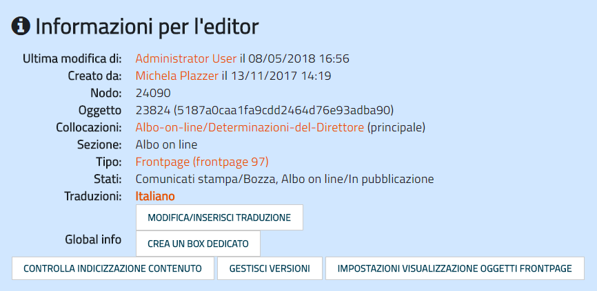

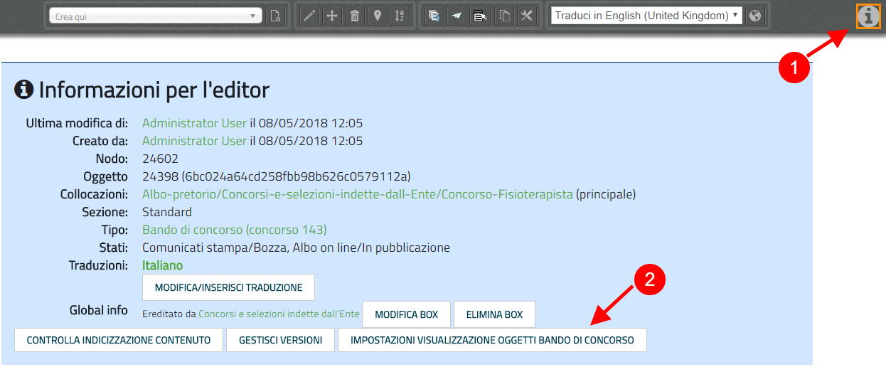

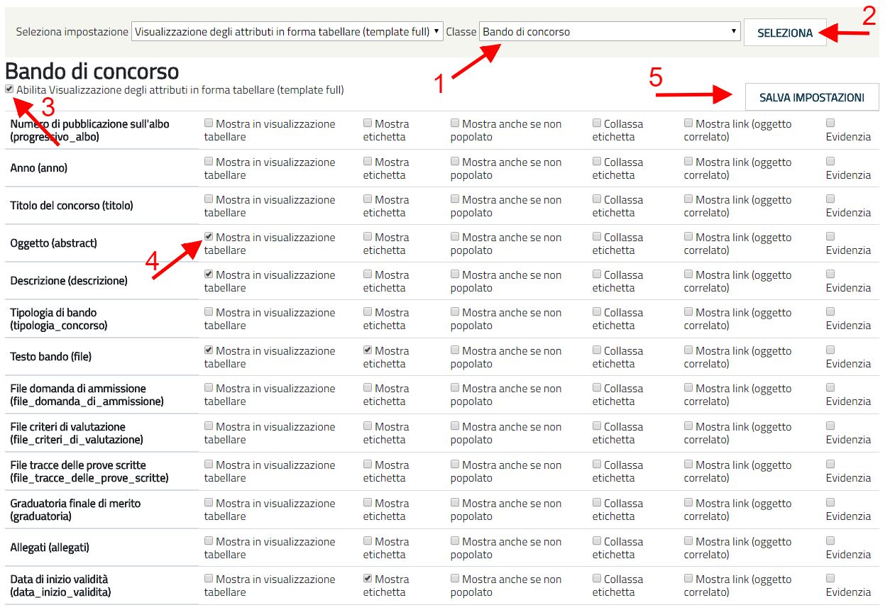

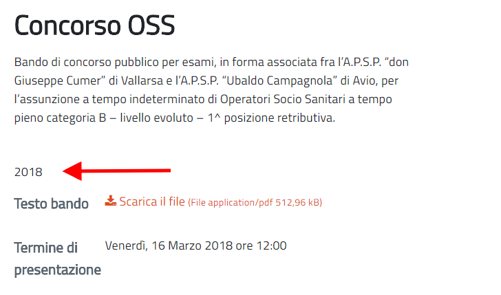

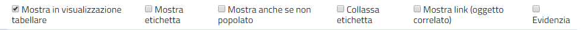

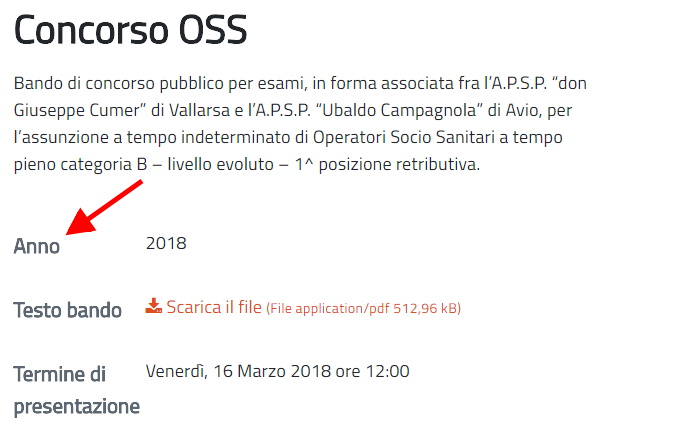

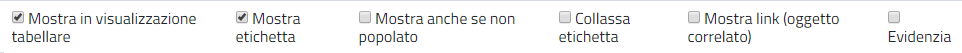

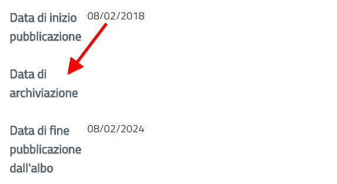

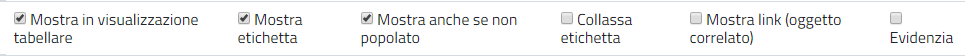

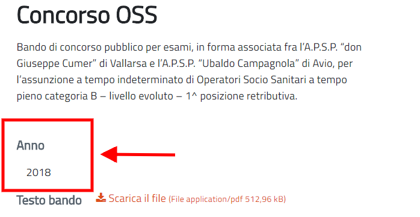

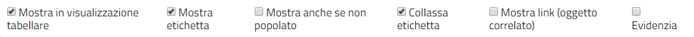

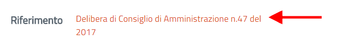

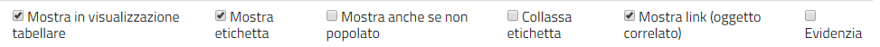

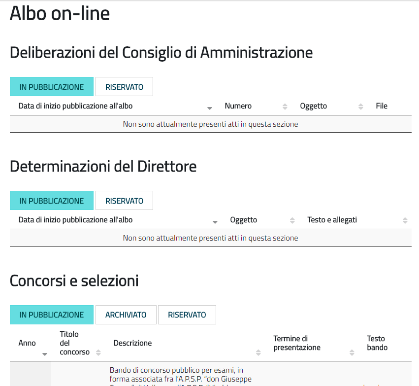

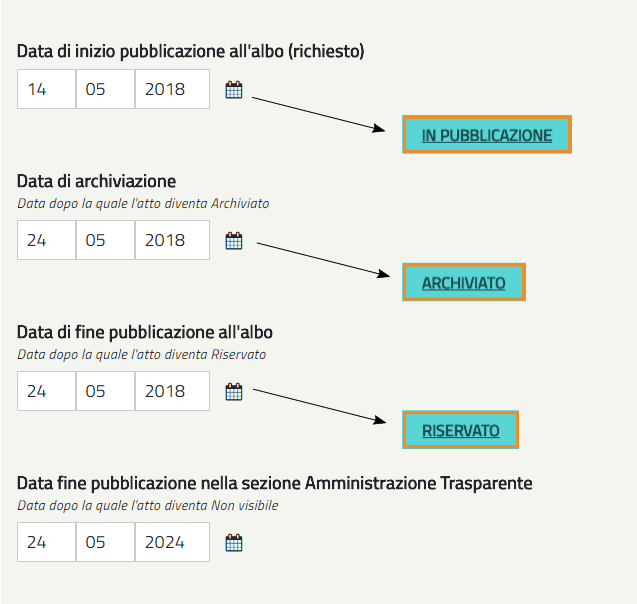

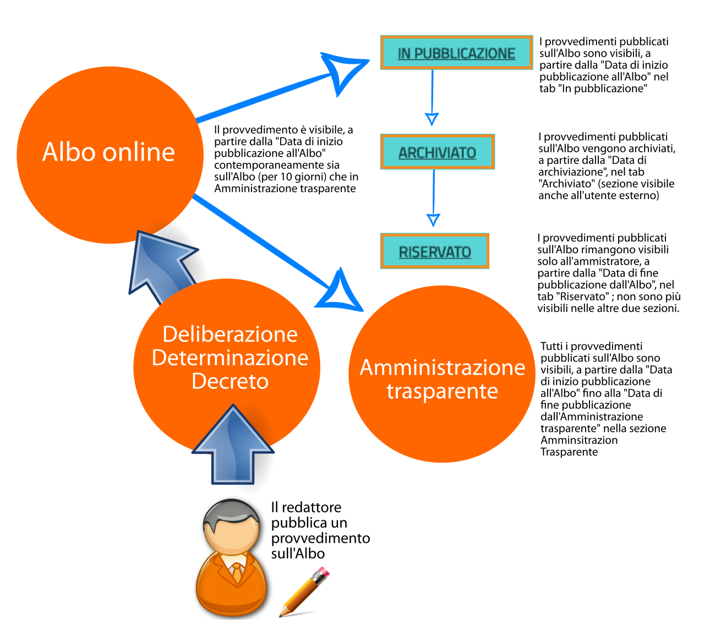

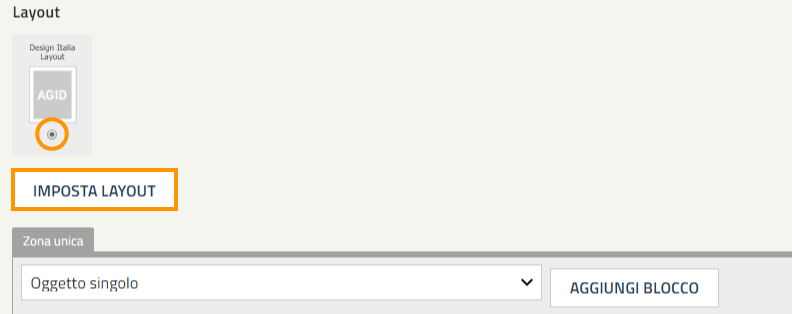

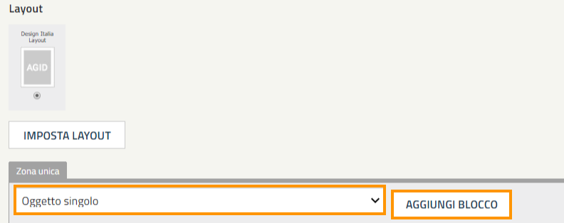

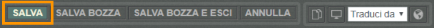

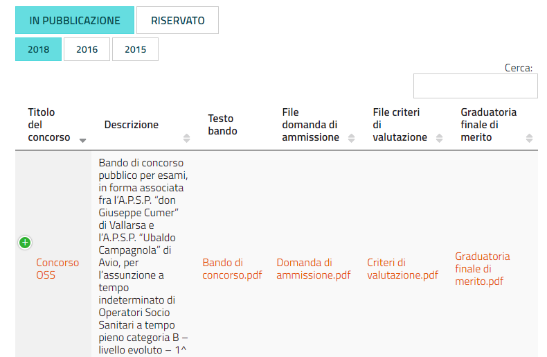

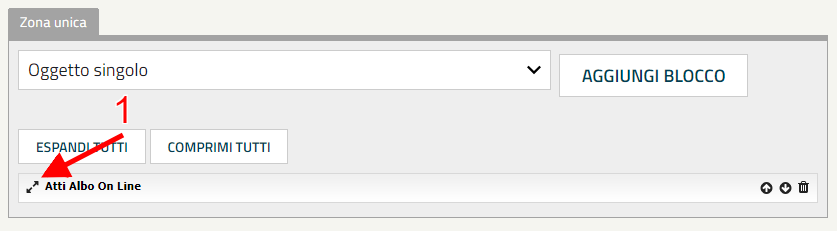

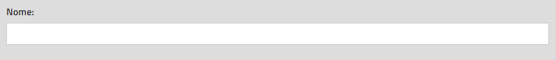

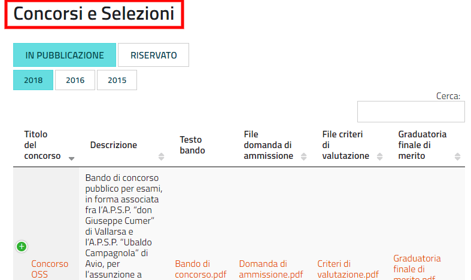

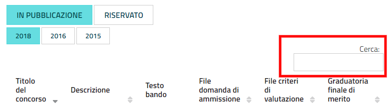

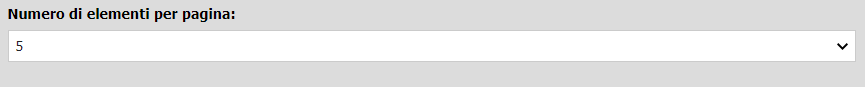

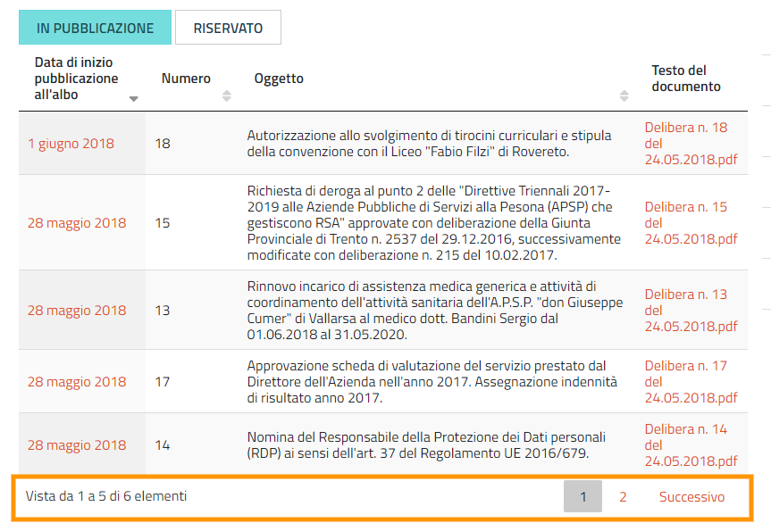

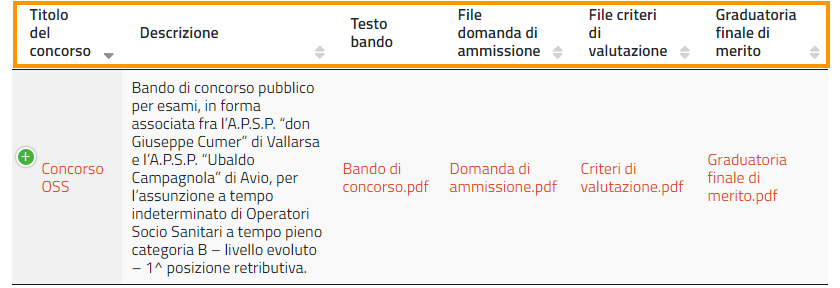

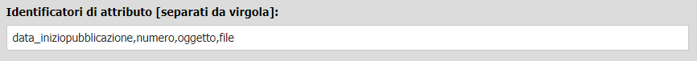

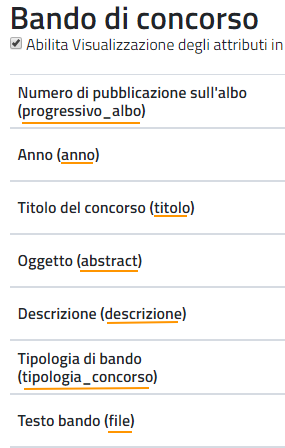

.. |IMG36| image:: static/1_34.png
   :height: 48 px
   :width: 521 px

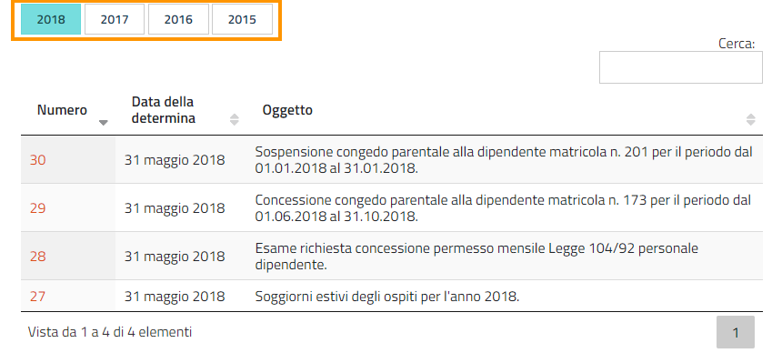

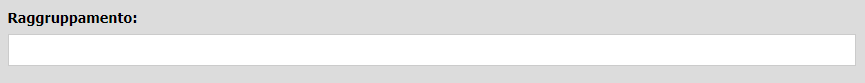

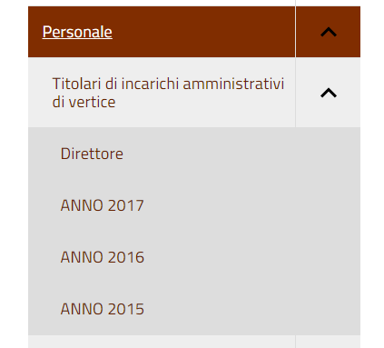
